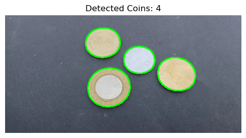

# Assignment 1: Coin Detection, Segmentation, Counting and Image Stitching



## Objective
This assignment focuses on detecting, segmenting, and counting coins in an image using image processing techniques in OpenCV.
Apart from this we also explore image stitching algorithms.

## Introduction and Setup

Copy paste the following set of commands to start with the Setup and trying repo code out.
```bash
git clone https://github.com/MandaKausthubh/VR_Assignment1_MandaKausthubh_IMT2022027.git 
cd VR_Assignment1_MandaKausthubh_IMT2022027/Assignment1
```

We also need to install the require conda environment:

```bash
conda create --name Assignment1 --file environment.yml
conda activate Assignment1
```

## Viewing the actual results
The actual submission can be viewed in the following files:
1. CoinDetection.ipynb
2. ImageStichingSIFT.ipynb

## Tasks
### 1. Detect All Coins in the Image
- Apply **edge detection** to identify all coins in the image.
- Visualize the detected coins by drawing outlines around them.

### 2. Segmentation of Each Coin
- Use **region-based segmentation techniques** to isolate individual coins.
- Provide segmented outputs for each detected coin.

### 3. Count the Total Number of Coins
- Implement a function to count the total number of detected coins.
- Display the final count as output.

## Approach
1. **Preprocessing:**
   - Convert image to grayscale.
   - Apply Gaussian blur to reduce noise.
   - We also try to reply the above two steps repeatedly. However this doesn't seem to always results in adding more noise and also joining the images.

2. **Edge Detection:**
   - Use Canny edge detection.
   - Alternatively, apply Laplacian or Hough Circle Transform for improved accuracy.
   - Canny edge detector however show results in a few images.

3. **Contour Detection & Segmentation:**
   - Find contours using `cv2.findContours()`.
   - Extract individual coins based on contour properties.

4. **Counting Coins:**
   - Count the number of detected contours.
   - Display the image with detected coins outlined.


## Output
- An image with detected coins outlined.
- Segmented images of individual coins.
- Printed count of detected coins.

---
### Notes
- Experiment with different edge detection and thresholding techniques for better results.
- Tune parameters for Gaussian blur and Canny edge detection to optimize performance.

