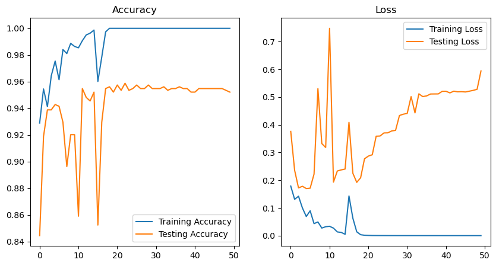
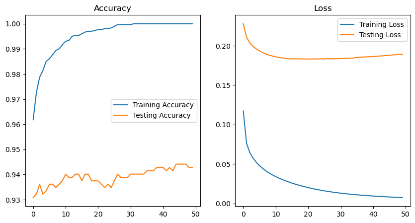
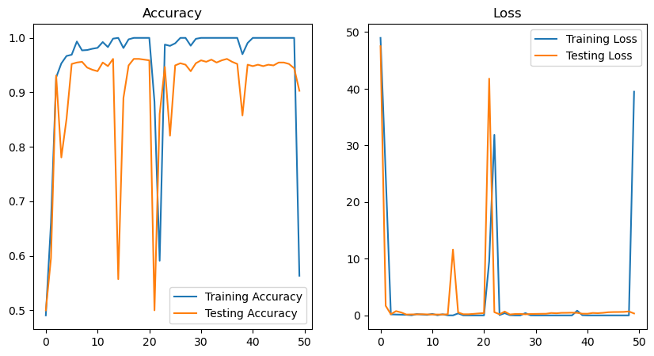
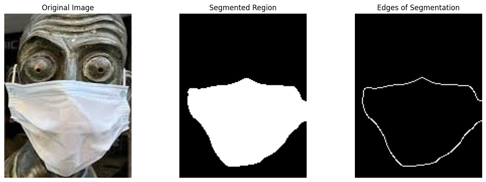
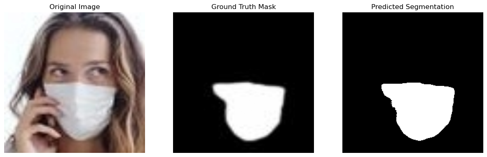

# Visual Recognition Project 1

## Overview
This project focuses on various aspects of visual recognition, encompassing multiple tasks as outlined in the provided notebooks. The repository is structured to facilitate clarity and ease of navigation through its distinct components.

The project can be divided into 4 Parts as described in the instructions for the MiniProjects on LMS:

- Task A: Building a Binary Classifier using Hand crafted features
- Task B: Building a Binary classifier using CNNs
- Task C: Building an Image Segmentation Program with Hand Crafted feature based traditional methods.
- Task D: Building a UNet for Image segmentation.

Note that the detailed design of the CNN and implementation of the Unet and the CNN can be found in the ```./Models``` folder of this directory.

## Dataset
This project uses the dataset provided by the instruction sheet. We couldn't upload the data to github as the files were too large and hence included in the ```.gitignore``` file. The structure of the dataset used in both the tasks is that they are stored in the ```./dataset``` folder and ```./MDFS``` folder. These folders can be found while creating the datasets for the ```Pytorch``` implementation in tasks (b) and (d).


## Repository Structure

The project directory is organized as follows:

- **models/**: Contains pre-trained or custom-trained models utilized in the project.
- **pictures/**: Holds images and visual results pertinent to the project's analyses and outputs.
- **utils/**: Includes utility scripts and helper functions to support various tasks within the project.
- **part_a.ipynb**: Notebook dedicated to the implementation and analysis of Part A of the project.
- **part_b.ipynb**: Notebook dedicated to the implementation and analysis of Part B of the project.
- **part_c.ipynb**: Notebook dedicated to the implementation and analysis of Part C of the project.
- **part_d.ipynb**: Notebook dedicated to the implementation and analysis of Part D of the project.

## Results and Observations for Training CNNs

### Result for using AdamW

### Result for using SGD

### Result for using RMSProp


Please note that similar tests couldn't be carried out for UNet because of the extensive training time. (5-6 hours on M4 Pro Macbook using MPS).


## Results of Segmentation:

### Traditional methods for segmentation


### Using UNet


## How to Use

1. **Clone the Repository**:
   ```bash
   git clone https://github.com/MandaKausthubh/VR_Assignment1_MandaKausthubh_IMT2022027.git
   ```

2. **Navigate to the Project Directory**:
   ```bash
   cd VR_Assignment1_MandaKausthubh_IMT2022027/VR_Project1_MandaKausthubh_IMT2022027
   ```

3. **Install Dependencies**:
   Ensure that all required libraries and packages are installed. Refer to any `requirements.txt` file or documentation provided within the project.

4. **Run the Notebooks**:
   Use Jupyter Notebook or JupyterLab to open and execute the notebooks (`part_a.ipynb`, `part_b.ipynb`, etc.) to explore the analyses and results.

## Notes

- Ensure that all necessary dependencies are installed before running the notebooks.
- Refer to the comments and documentation within each notebook for detailed explanations of the methodologies and analyses.
- For any issues or questions, please refer to the project's main repository or contact the author.

## Contributions:
- Manda Kausthubh: Part (b), Part (d) and README
- Ishan Jha: Part (a) and Part(c)
- Subham Agarwal: Part(a) and Part(c)